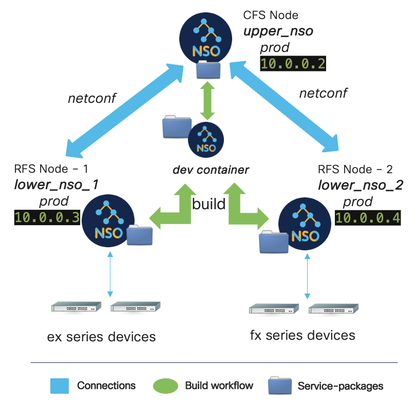
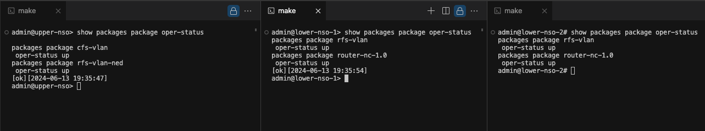
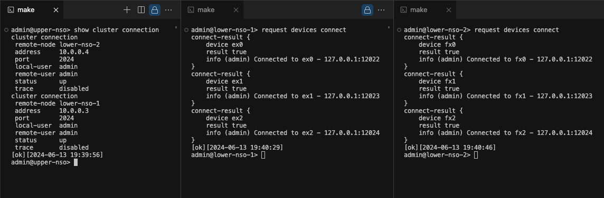

# Implementing Layered Service Architecture with NSO Official Docker Image (Single Version)




## Basic Architecture:

Containerized NSO workflow can be divided into two part on an abstract, i.e production and development.

**Production containers are used for running NSO instances while Development containers are solely purposed for developing, building the service packages.**

In this example, our NSO setup contains four nodes:
* **nso_upper** : Top-level CFS Node that propogates the upper service logic to RFS Nodes under it. It is of type production.
* **nso_lower_1** : Low-level RFS Node that handles catering service configurations to "ex" namespace devices. It is of type **Production**.
* **nso_lower_2** : Low-level RFS Node that handles catering service configurations to "fx" namespace devices. It is of type **Production**.
* **nso_dev** : A container which contains volume maps of all production containers' (listed above) service packages, but doesn't include any running instance of NSO (or is not intended to even run NSO). It is of type **Development**, hence is only used to develop service packages and build them.

## Instructions for self-demonstrating kit:

Ensure that you are running docker engine and associated service.

Clone the repo and enter into the repo folder on your system.

In the folder images, store the NSO docker images of both production and development types available from Cisco download center of your desired NSO version. Please note that production and development images should be of same NSO version.

Run ```make build [VER=<NSO version> (6.2.3 is default)] [ARCH=<your CPU architecture> (x86_64 is default)]```, you will see following output generated and this takes a while to process:

```
docker load -i ./images/nso-6.2.3.container-image-dev.linux.x86_64.tar.gz
Loaded image: cisco-nso-dev:6.2.3
docker load -i ./images/nso-6.2.3.container-image-prod.linux.x86_64.tar.gz
Loaded image: cisco-nso-prod:6.2.3
docker build -t mod-nso-prod:6.2.3  --no-cache --network=host --build-arg type="prod"  --build-arg ver=6.2.3  --file Dockerfile .
...
Sending build context to Docker daemon  1.389GB
Step 1/6 : ARG  type ver
     ..... truncated for brevity
```
The build target starts with loading docker images, creates containers for each node, builds file structure, using dev container creates packages **router** and **lsa-ned** for production nodes, compiles them. It also copies required configurations for nodes and devices during CDB booting.

After it's done, run ```make start```
```
% make start
export VER=6.2.3 ; docker-compose up UPPER LOWER-1 LOWER-2 BUILD-NSO-PKGS -d
[+] Running 3/1
 ⠙ Network docker_lsa_new_NSO-net                                                                                                                         Created0.2s 
 ⠋ Container nso_lower_2                                                                                                                                  Created0.1s 
 ⠋ Container nso_upper                                                                                                                                    Created0.1s 
 ⠋ Container nso-dev                                                                             [+] Running 4/8                                          Creating0.1s 
 ........
```
This will attempt to start all containers, run startup scripts ```init.sh``` on each container. Additionally, On lower-nso nodes, it will create set of 3 devices for each node using **router** NED, starts them.

Now athat environment is setup completed, We will verify if the environment has been setup successfully.

##### List the running containers using:

```docker ps | grep nso```

**Example**:
```
% docker ps --format 'table {{.ID}}\t{{.Names}}\t{{.Image}}\t{{.Status}}' | grep nso
26b8a3dac60d   nso-dev                  mod-nso-dev:6.2.3            Up 28 minutes
a7f597e1a39e   nso_lower_2              mod-nso-prod:6.2.3           Up 28 minutes (healthy)
ab522156a46b   nso_lower_1              mod-nso-prod:6.2.3           Up 28 minutes (healthy)
b56dfe7c9aae   nso_upper                mod-nso-prod:6.2.3           Up 28 minutes (healthy)
```

Open three terminals under current folder and run the following commands correspondingly:
```
make cli-c_nso_upper   (for juniper terminal: cli-j_nso_upper)
make cli-c_nso_lower_1 (for juniper terminal: cli-j_nso_lower_1)
make cli-c_nso_lower_2 (for juniper terminal: cli-j_nso_lower_2)
```


##### While in NSO cli from each terminal, Check the status of packages on each Node:



##### Check into all nodes, if the status of nodes' connection and devices is up:



You can see that the connection between upper and lower nodes is up, also the communication between lower nodes and their devices is also setup.


This completes the environment setup and verification.

#### Running this example:

Now we will check how service can be deployed layer wise from upper through the lower nodes:

Get into the upper node terminal and supply the following command to deploy service:
```
admin@upper-nso% set cfs-vlan v1 a-router ex0 z-router fx0 iface eth3 unit 3 vid 77
[ok][2024-06-13 19:42:33]
[edit]
admin@upper-nso% commit dry-run 
cli {
    local-node {
        data  ncs:devices {
                  device lower-nso-1 {
                      config {
                          services {
             +                vlan v1 {
             +                    router ex0;
             +                    iface eth3;
             +                    unit 3;
             +                    vid 77;
             +                    description "Interface owned by CFS: v1";
             +                }
                          }
                      }
                  }
                  device lower-nso-2 {
                      config {
                          services {
             +                vlan v1 {
             +                    router fx0;
             +                    iface eth3;
             +                    unit 3;
             +                    vid 77;
             +                    description "Interface owned by CFS: v1";
             +                }
                          }
                      }
                  }
              }
             +cfs-vlan v1 {
             +    a-router ex0;
             +    z-router fx0;
             +    iface eth3;
             +    unit 3;
             +    vid 77;
             +}
    }
    lsa-node {
        name lower-nso-1
        data  devices {
                  device ex0 {
                      config {
                          sys {
                              interfaces {
             +                    interface eth3 {
             +                        enabled;
             +                        unit 3 {
             +                            enabled;
             +                            description "Interface owned by CFS: v1";
             +                            vlan-id 77;
             +                        }
             +                    }
                              }
                          }
                      }
                  }
              }
              rfs-vlan:services {
             +    vlan v1 {
             +        router ex0;
             +        iface eth3;
             +        unit 3;
             +        vid 77;
             +        description "Interface owned by CFS: v1";
             +    }
              }
    }
    lsa-node {
        name lower-nso-2
        data  devices {
                  device fx0 {
                      config {
                          sys {
                              interfaces {
             +                    interface eth3 {
             +                        enabled;
             +                        unit 3 {
             +                            enabled;
             +                            description "Interface owned by CFS: v1";
             +                            vlan-id 77;
             +                        }
             +                    }
                              }
                          }
                      }
                  }
              }
              rfs-vlan:services {
             +    vlan v1 {
             +        router fx0;
             +        iface eth3;
             +        unit 3;
             +        vid 77;
             +        description "Interface owned by CFS: v1";
             +    }
              }
    }
}
[ok][2024-06-13 19:43:31]
```


On upper node, Service is deployed through the template:
**./upper-nso/packages/cfs-vlan/templates/cfs-vlan-template.xml**

On lower nodes, following template will be used respectively:
**./lower-nso-1/packages/rfs-vlan/templates/rfs-vlan-template.xml for ex0 device and**
**./lower-nso-2/packages/rfs-vlan/templates/rfs-vlan-template.xml for fx0 device**


After you commit the service on upper node, you will see the terminals of lower nodes displaying the following messages:

##### On lower node 1:
```
admin@lower-nso-1# 
System message at 2024-06-13 19:43:31...
Commit performed by admin via ssh using netconf.
```
##### On lower node 2:
```
admin@lower-nso-2# 
System message at 2024-06-13 19:43:31...
Commit performed by admin via ssh using netconf.
```

###### Check the forward diff-set of the service on upper node:

```
admin@upper-nso% request cfs-vlan v1 get-modifications
cli {
    local-node {
        data  ncs:devices {
                   device lower-nso-1 {
                       config {
                           services {
              +                vlan v1 {
              +                    router ex0;
              +                    iface eth3;
              +                    unit 3;
              +                    vid 77;
              +                    description "Interface owned by CFS: v1";
              +                }
                           }
                       }
                   }
                   device lower-nso-2 {
                       config {
                           services {
              +                vlan v1 {
              +                    router fx0;
              +                    iface eth3;
              +                    unit 3;
              +                    vid 77;
              +                    description "Interface owned by CFS: v1";
              +                }
                           }
                       }
                   }
               }
              
    }
}
```
All changed data both on the local node and on the remote lower nodes
is displayed.

##### After you are done, You can now stop the containers:

```make stop```

##### To clean cdb:
```make clean_cdb```

##### To clean the containers:

```make clean_containers```

##### To deep clean the environment, including the images built:

```make deep_clean VER=<Your NSO Image version>```